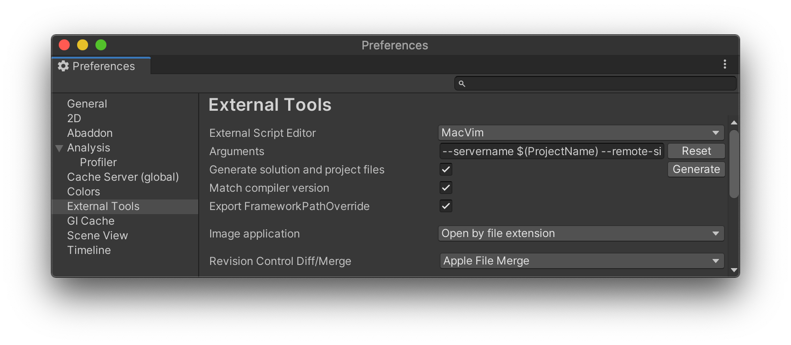

# Easy Editor

Unity package to automate external text editor integrations:

- List compatible installed editors.
- Per editor settings.
- Project files (re)generation.

## Installation

Install via [Unity Package Manager](https://docs.unity3d.com/Manual/upm-ui.html). There are several flavours:

1. [git URL](https://docs.unity3d.com/Manual/upm-ui-giturl.html):

```
https://github.com/frarees/easyeditor.git
```

Alternatively, you can install a specific version:

```
https://github.com/frarees/easyeditor.git#v0.5.0
```

2. [Local tarball](https://docs.unity3d.com/Manual/upm-ui-tarball.html):

Each [release](https://github.com/frarees/easyeditor/releases) includes a tarball named `com.frarees.easyeditor-<version>.tgz`.

3. [Local folder](https://docs.unity3d.com/Manual/upm-ui-local.html):

Download the repository contents and point Unity Package Manager to the `package.json` file.

You can download the repository as a compressed file for a specific [tag](https://github.com/frarees/easyeditor/tags).

## Usage

Select your favourite [external script editor](https://docs.unity3d.com/Manual/Preferences.html#External-Tools) in Unity. You will get specific settings per editor. The rest is taken care of.



## Supported editors

| Editor         | Windows | macOS | Linux |
| :------------: | :-----: | :---: | :---: |
| MacVim         |         | ✅    |       |
| VimR           |         | ✅    |       |
| gVim           | ✅      |       |       |
| Sublime Text 3 | ✅      | ✅    |       |

_gVim versions 8.1 and 8.2._

Is there an editor you miss on this list? [Ask for it](https://github.com/frarees/easyeditor/issues/new?assignees=frarees&labels=enhancement&template=feature_request.md&title=) or [contribute](CONTRIBUTING.md) your implementation.

## Limitations

Text editor executables are currently searched in their default installation paths.

## Contributing

See [contributing](CONTRIBUTING.md) and the [code of conduct](CODE_OF_CONDUCT.md).

